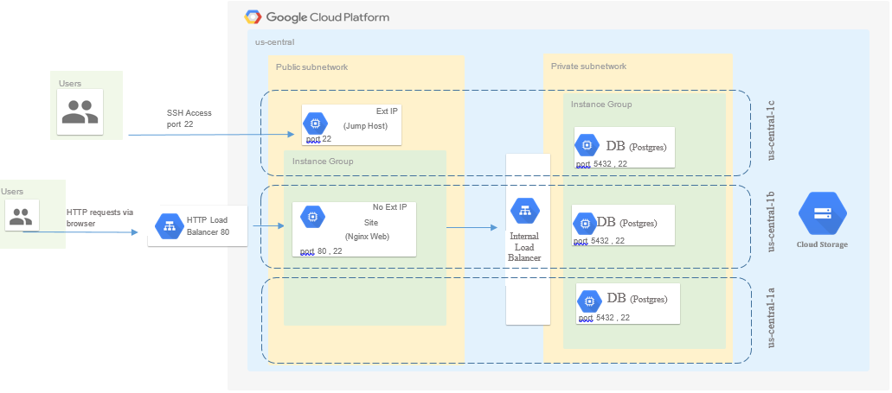

# Terraform final task
This folder contains code to create the following configuration:

## Quick start
**Note**: This example deploys resources into your GCP account. Do not delete or modify the marked lines in `main.tf`
1. Install [Terraform](https://www.terraform.io/).
1. Open file `backend.tf` and change bucket name (must be created before next steps). If you don't need remote storage for keeping terraform backend just delete this file `backend.tf`
1. Set your GCP credentials as the environment variables:
    * export GOOGLE_CLOUD_KEYFILE_JSON=/path/to/file
1. Open file `terraform.tfvars` and change:
    * gcp_user = "your_user_name"
    * gcp_key = "your_public_key" 
1. Run `terraform init`.
1. Run `terraform apply`.
1. After it's done deploying the example will output URL of web-site, command for ssh connection and innternal IP for postgres load balancer. Before ssh run following commands
    * eval \`ssh-agent\`
    * ssh-add ~/.ssh/google_compute_engine
1. To clean up and delete all resources after you're done, run `terraform destroy`.

