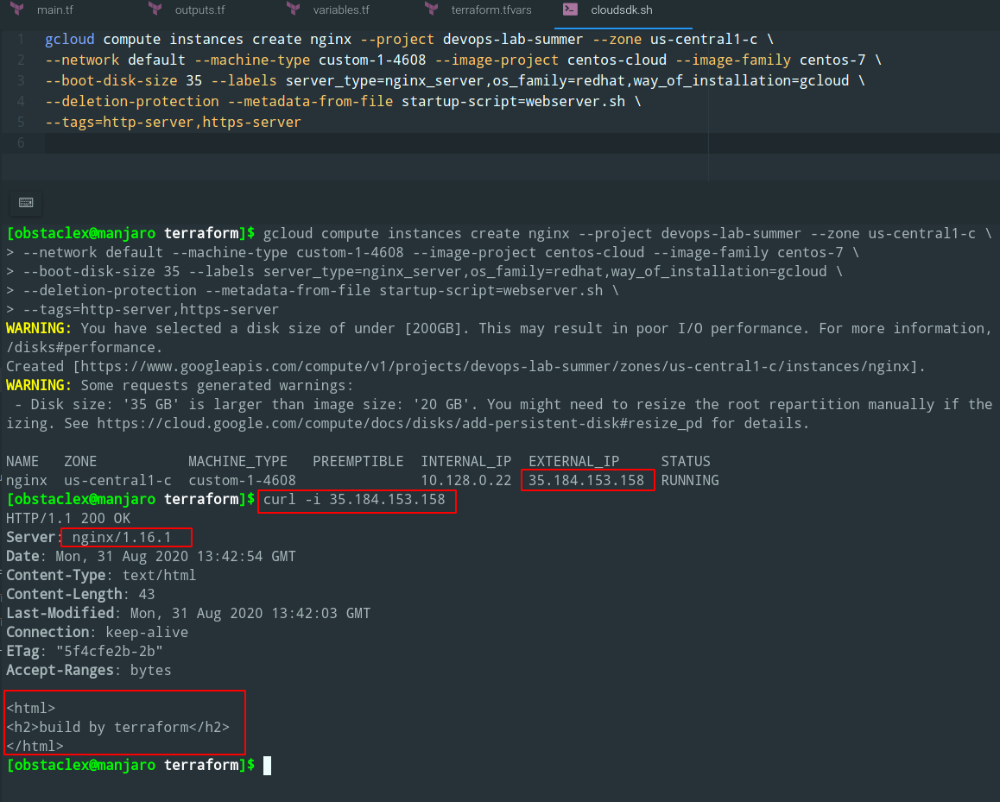
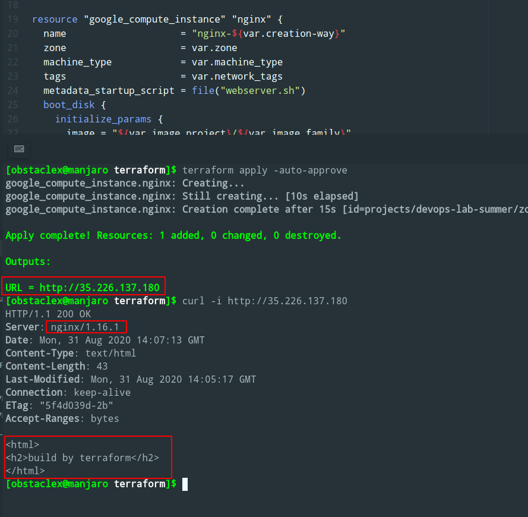
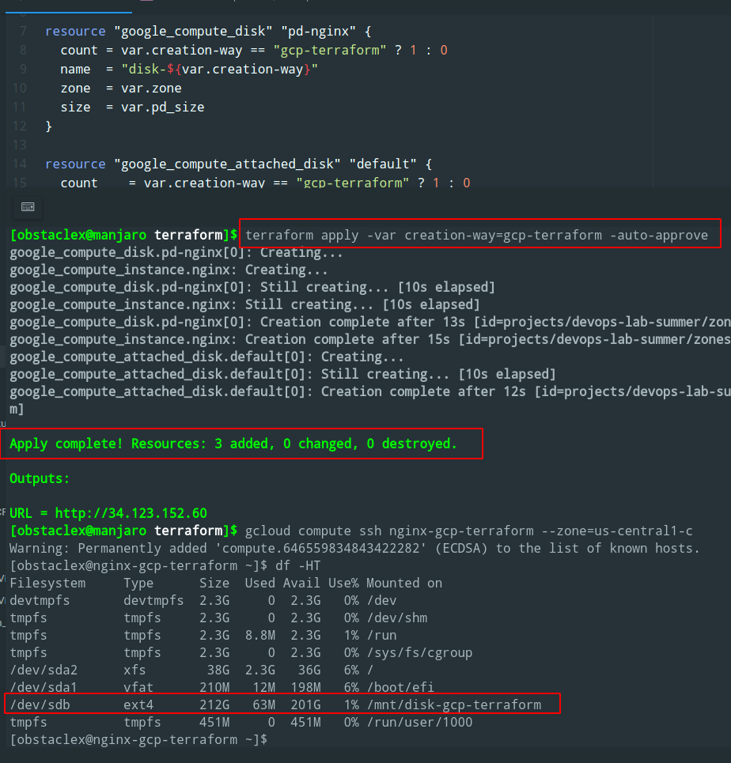
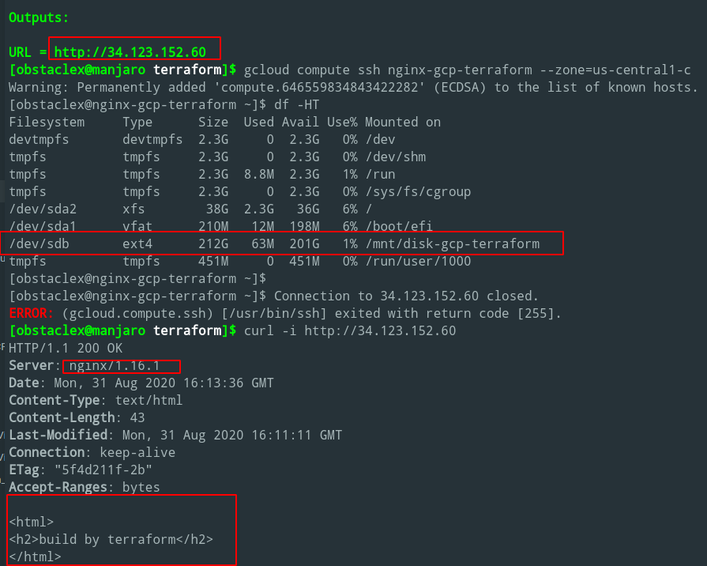

# google-cloud-module

Created VM by gcloud with required properties

Command, which provides below conatins in cloudsdk.sh

Created VM by terraform with required properties

All conf files have .tf and .tfvars extension in this repository

Created VM by terraform with persistent disk and all required properties

.tf files uses dynamic external file (template) and different conditions

If -var created-way=gcp-terraform next resources will be created 

1) Standart persistent disk

2) Attached pd

3) VM with ext4 filesystem on attached pd 

 
